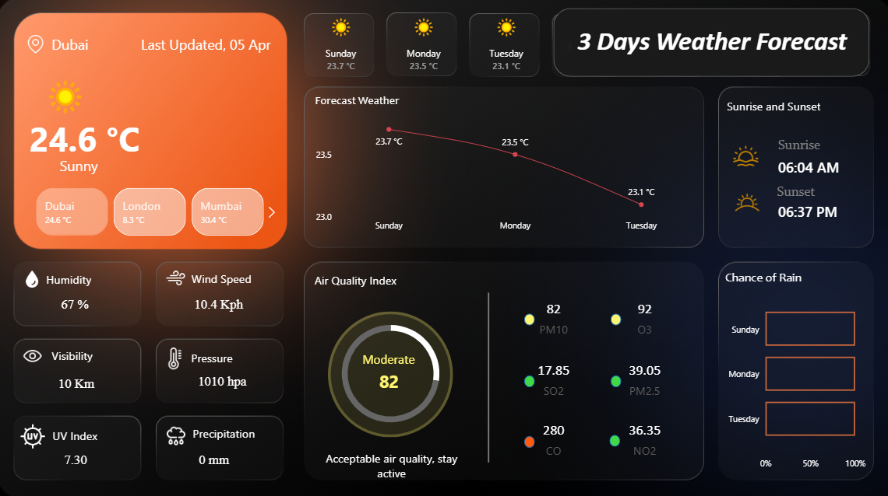

# Weather Intelligence Dashboard

## Project Overview
This project is an End-to-End Power BI solution that transforms live data from WeatherAPI.com into an executive-level monitoring tool. It provides a real-time, consolidated view of global weather conditions, 72-hour forecasts, and critical air quality metrics for cities like Dubai, London, Mumbai, New York and Toronto.

## 📊 Dashboard Preview

## Business Problem
Decision-makers often struggle with weather data because it is:

 * Scattered: Spread across multiple apps and websites.
   
 * Unstructured: Delivered in complex, "raw" formats (JSON).
   
 * Reactive: Focused on "what happened" rather than "what is coming."
   
**The Solution:** This dashboard acts as a Centralized Intelligence Hub,turning complex data into a granular, 72-hour visual story for immediate risk assessment.

## Data Source
   ### Primary Source:  
   * WeatherAPI.com 
   ### Data Processing:
   * API connection in Power BI.
   * JSON expansion using Power Query.
   * Data cleaning and column formatting.
   * Structured relational modeling.

## Technical Architecture
I utilized a Multi-Fact Star Schema to ensure the dashboard remains fast and accurate across different levels of detail.

 * **Central Dimension:** Location (Master city list for dynamic filtering).

 * **Fact Tables:**
   
   * **Current:** Real-time atmospheric observations.

   * **Forecast_Day:** 3-day trend summaries.

   * **Forecast_Hour:** Granular 24-hour time-series data.

**Relationship Logic:** One-to-Many relationships ensure that city filters flow correctly across all visuals without data inflation.

## Key Features & KPIs
 **1. Real-Time Monitoring**
 
  * **Core Metrics:** Live Temperature (°C), Humidity, Wind Speed (Kph), and Pressure.

  * **Visibility & UV Index:** Safety indicators for transportation and outdoor planning.

 **2. 72-Hour Forecast Analytics**
 
  * **Temperature Trends:** Visual line charts showing short-term fluctuations.

  * **Chance of Rain:** Probability-based bars (0–100%) for proactive scheduling.

 **3. Environmental Health (AQI)**
 
  * **Diagnostic Tracking:** Real-time monitoring of PM2.5, PM10, CO, and NO₂.

  * **Status Gauge:** Instant color-coded categorization (Good / Moderate / Unhealthy).

## Tools & Technologies Used
   * **Visualization:** Power BI Desktop
   * **Data Ingestion:** REST API (WeatherAPI)
   * **Transformation:** Power Query (M)
   * **Calculations:** DAX (Data Analysis Expressions)
   * **Modeling:** Dimensional Star Schema
     
## Key Insights
  * **Trend Analysis:** Unlike standard apps that show one icon per day, this model analyzes 72 individual hourly data points to pinpoint exactly when temperature peaks or rain begins.

  * **Risk Evaluation:** Links UV Index and Air Quality (AQI) data together to highlight hidden health risks that a single metric might miss.

  * **Comparative Analytics:** Enables instant side-by-side evaluation of weather conditions across different cities to identify regional environmental shifts.

  * **Pollutant Breakdown:** Tracks specific levels of PM2.5, CO, and NO₂ to show exactly which pollutants are causing "Unhealthy" or "Moderate" air quality.
   
## Business Applications
  * **Logistics & Routing:** Helps managers avoid high-probability rain windows to protect cargo and ensure driver safety during deliveries.

  * **Operational Planning:** Provides a "Go/No-Go" decision tool for construction or outdoor events based on 3-day precipitation trends.

  * **Public Health Alerts:** Allows authorities to issue safety warnings when AQI or UV levels reach dangerous thresholds for the public.

  * **Workforce Safety (HSE):** Helps safety officers manage heat-stress protocols for outdoor workers using live thermal and sun exposure data.

  * **Energy Demand:** Assists utility companies in predicting surges in cooling or heating needs by tracking upcoming temperature spikes.

  * **Inventory Management:** Helps retail businesses adjust stock for items like umbrellas or cooling drinks based on 72-hour weather shifts.

## Limitations:
  * Currently limited to a 72-hour forecast however, the Star Schema is built to scale to 14-day premium data instantly.

  * Provides real-time snapshots only. A future iteration would involve connecting a SQL Database to perform Year-over-Year (YoY) trend analysis.

  * City selection is pre-defined. Next steps include Dynamic Parameters to fetch data for any global coordinate on demand.
